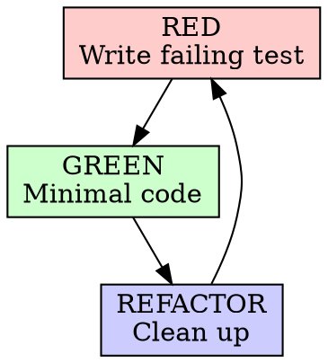
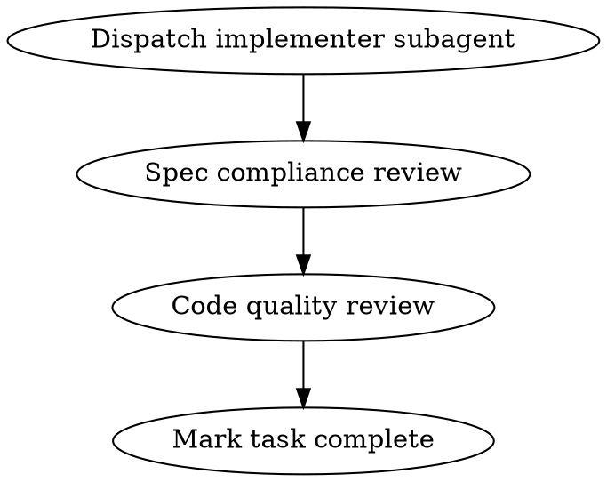
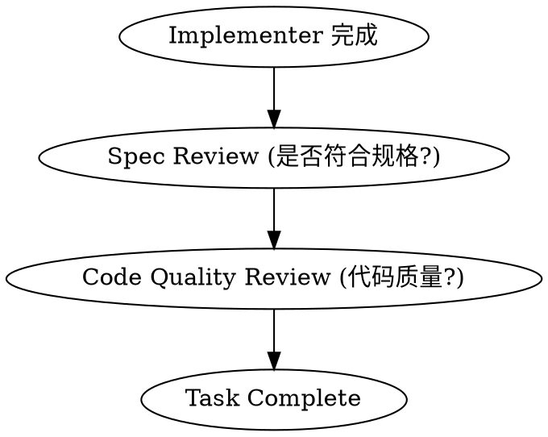

# Superpowers 项目研究报告

**Commit SHA**: `eafe962b18f6c5dc70fb7c8cc7e83e61f4cdde06`  
**版本**: 5.0.6  
**项目地址**: https://github.com/obra/superpowers

---

## 1. 项目概述

### 1.1 主要目标与定位

Superpowers 是一个面向 AI 编程代理的**完整软件开发工作流程框架**，通过一组可组合的"技能"(Skills) 和初始指令确保代理在编码时遵循最佳实践。

**核心价值主张**：
- 不再让代理直接跳入写代码
- 通过 Socratic 提问细化需求 → 呈现设计 → 制定计划 → 分任务执行
- 强调 TDD、YAGNI、DRY 原则
- 代理可以自主工作数小时而不偏离计划

**Evidence** ([README.md L1-15](https://github.com/obra/superpowers/blob/eafe962b18f6c5dc70fb7c8cc7e83e61f4cdde06/README.md#L1-L15)):

> "Superpowers is a complete software development workflow for your coding agents, built on top of a set of composable 'skills'..."

---

## 2. 技术架构

### 2.1 项目目录结构

```
superpowers/
├── skills/                      # 核心技能模块（15个技能）
│   ├── brainstorming/          # 头脑风暴 → 设计阶段
│   ├── using-git-worktrees/    # Git worktree 隔离工作区
│   ├── writing-plans/          # 制定实施计划
│   ├── subagent-driven-development/  # 子代理驱动开发
│   ├── executing-plans/        # 批量执行计划
│   ├── dispatching-parallel-agents/ # 并行代理调度
│   ├── test-driven-development/# TDD 红绿重构循环
│   ├── systematic-debugging/   # 系统化调试
│   ├── verification-before-completion/ # 完成前验证
│   ├── requesting-code-review/ # 请求代码审查
│   ├── receiving-code-review/  # 接收代码审查反馈
│   ├── finishing-a-development-branch/ # 完成开发分支
│   ├── using-superpowers/     # 技能系统入门
│   └── writing-skills/         # 技能编写指南
├── agents/                     # 代理定义
│   └── code-reviewer.md        # 代码审查代理模板
├── hooks/                      # 平台钩子
│   ├── session-start           # 会话启动钩子
│   └── hooks.json
├── .claude-plugin/             # Claude Code 插件配置
├── .opencode/                  # OpenCode 插件配置
├── .codex/                     # Codex 配置
└── docs/                       # 文档
```

### 2.2 技术栈

**Evidence** ([package.json](https://github.com/obra/superpowers/blob/eafe962b18f6c5dc70fb7c8cc7e83e61f4cdde06/package.json)):

```json
{
  "name": "superpowers",
  "version": "5.0.6",
  "type": "module",
  "main": ".opencode/plugins/superpowers.js"
}
```

**插件核心实现** ([.opencode/plugins/superpowers.js](https://github.com/obra/superpowers/blob/eafe962b18f6c5dc70fb7c8cc7e83e61f4cdde06/.opencode/plugins/superpowers.js#L1-L107))：
- 纯 JavaScript ES Module，无外部依赖
- 路径处理使用 Node.js 内置 `path`、`fs`、`os` 模块
- 通过 OpenCode 插件 API 注入技能路径和系统提示

### 2.3 插件系统设计原理

**多平台支持架构**：

| 平台 | 配置位置 | 加载方式 |
|------|----------|----------|
| **Claude Code** | `.claude-plugin/` | 插件市场 + SessionStart hook |
| **OpenCode** | `.opencode/` | Node.js 插件系统 |
| **Codex** | `.codex/` | 符号链接到 `~/.agents/skills/` |
| **Cursor** | `hooks/` | sessionStart hook |
| **Gemini CLI** | `gemini-extension.json` | 扩展安装 |

**Evidence** ([hooks/session-start](https://github.com/obra/superpowers/blob/eafe962b18f6c5dc70fb7c8cc7e83e61f4cdde06/hooks/session-start#L1-L57))：

```bash
# 核心机制：读取 using-superpowers 技能内容
using_superpowers_content=$(cat "${PLUGIN_ROOT}/skills/using-superpowers/SKILL.md")

# 平台检测并注入上下文
if [ -n "${CURSOR_PLUGIN_ROOT:-}" ]; then
  printf '{"additional_context": "%s"}\n' "$session_context"
elif [ -n "${CLAUDE_PLUGIN_ROOT:-}" ]; then
  printf '{"hookSpecificOutput": {...}}\n' "$session_context"
fi
```

---

## 3. 技能模块详细分析

### 3.1 技能总览

| 技能名称 | 触发条件描述 | 类型 |
|----------|--------------|------|
| `brainstorming` | 任何创作性工作之前（功能、组件、行为修改） | 流程 |
| `using-git-worktrees` | 开始需要隔离的功能工作或执行实施计划前 | 流程 |
| `writing-plans` | 有规格说明或需求的多元任务，在接触代码前 | 流程 |
| `subagent-driven-development` | 执行具有独立任务的实施计划 | 流程 |
| `executing-plans` | 在单独会话中执行书面实施计划 | 流程 |
| `dispatching-parallel-agents` | 面临 2+ 个可并行处理的独立任务 | 流程 |
| `test-driven-development` | 实现任何功能或修复 bug 前，在写代码前 | 纪律 |
| `systematic-debugging` | 遇到任何 bug、测试失败或意外行为 | 流程 |
| `verification-before-completion` | 声称工作完成、固定或通过前 | 纪律 |
| `requesting-code-review` | 完成任务、实现重大功能或合并前 | 流程 |
| `receiving-code-review` | 接收代码审查反馈时 | 流程 |
| `finishing-a-development-branch` | 实现完成、测试通过后决定如何集成 | 流程 |
| `using-superpowers` | 开始任何对话时（建立技能系统使用规范） | 入门 |
| `writing-skills` | 创建新技能、编辑现有技能或验证技能 | 元技能 |

### 3.2 技能结构规范

**Evidence** ([writing-skills/SKILL.md L94-137](https://github.com/obra/superpowers/blob/eafe962b18f6c5dc70fb7c8cc7e83e61f4cdde06/skills/writing-skills/SKILL.md#L94-L137))：

```markdown
---
name: skill-name-with-hyphens      # 必需：字母、数字、连字符
description: Use when [具体触发条件]  # 必需：第三人称，描述何时使用
---

# Skill Name

## Overview           # 核心原则 1-2 句
## When to Use       # 症状和使用场景
## Core Pattern       # 技术/模式的核心模式
## Quick Reference    # 快速参考表
## Implementation     # 实现细节
## Common Mistakes    # 常见错误
```

**关键设计原则**：
1. **扁平命名空间** - 所有技能在同一目录可搜索
2. **描述 = 触发条件，非工作流摘要** - 避免 Claude 走捷径
3. **TDD for Skills** - 先测试后编写技能

### 3.3 典型技能详解

#### 3.3.1 test-driven-development (TDD)

**核心铁律**：

```
NO PRODUCTION CODE WITHOUT A FAILING TEST FIRST
```

**Evidence** ([test-driven-development/SKILL.md L31-45](https://github.com/obra/superpowers/blob/eafe962b18f6c5dc70fb7c8cc7e83e61f4cdde06/skills/test-driven-development/SKILL.md#L31-L45))：



**纪律强化机制**：
- 明确的"红线"列表（代码先于测试 → 删除并重做）
- Rationalization 表格（防止借口）
- 测试先行的原因论证（反驳"之后测试也一样"的观点）

#### 3.3.2 subagent-driven-development

**核心创新**：每个任务使用新鲜子代理 + 两阶段审查

**Evidence** ([subagent-driven-development/SKILL.md L40-85](https://github.com/obra/superpowers/blob/eafe962b18f6c5dc70fb7c8cc7e83e61f4cdde06/skills/subagent-driven-development/SKILL.md#L40-L85))：



**子代理模板**：
- `implementer-prompt.md` - 实施者提示
- `spec-reviewer-prompt.md` - 规格合规审查
- `code-quality-reviewer-prompt.md` - 代码质量审查

#### 3.3.3 systematic-debugging

**四阶段调试法**：

| 阶段 | 关键活动 | 成功标准 |
|------|----------|----------|
| 1. Root Cause | 读错误、复现、检查变更、收集证据 | 理解 WHAT 和 WHY |
| 2. Pattern | 找类似代码、比较差异 | 识别差异 |
| 3. Hypothesis | 形成理论、最小测试 | 确认或新假设 |
| 4. Implementation | 创建测试、修复、验证 | Bug 解决、测试通过 |

**Evidence** ([systematic-debugging/SKILL.md L46-98](https://github.com/obra/superpowers/blob/eafe962b18f6c5dc70fb7c8cc7e83e61f4cdde06/skills/systematic-debugging/SKILL.md#L46-L98))：

```bash
# 多组件系统诊断模式
echo "=== Layer 1: Workflow ==="
echo "IDENTITY: ${IDENTITY:+SET}${IDENTITY:-UNSET}"
# ... 每层边界添加诊断日志
```

#### 3.3.4 brainstorming

**强制门控**：

```
<HARD-GATE>
Do NOT invoke any implementation skill, write any code... 
until you have presented a design and the user has approved it.
</HARD-GATE>
```

**Evidence** ([brainstorming/SKILL.md L12-14](https://github.com/obra/superpowers/blob/eafe962b18f6c5dc70fb7c8cc7e83e61f4cdde06/skills/brainstorming/SKILL.md#L12-L14))：

**完整流程**：
1. 探索项目上下文
2. 提供 Visual Companion（如有视觉问题）
3. 逐个提问澄清
4. 提出 2-3 种方案
5. 分段呈现设计
6. 写设计文档
7. 自审
8. 用户审阅
9. 调用 writing-plans

### 3.4 技能间依赖关系

```
brainstorming
    ↓
using-git-worktrees (在设计批准后)
    ↓
writing-plans
    ↓
subagent-driven-development OR executing-plans
    ↓  (每任务)
test-driven-development
    ↓  (必要时)
systematic-debugging
    ↓
verification-before-completion
    ↓
requesting-code-review
    ↓
finishing-a-development-branch
```

---

## 4. 技能接口规范

### 4.1 技能暴露机制

**YAML Frontmatter**：

```yaml
---
name: skill-name           # 技能标识符
description: Use when...   # 触发条件描述（用于 AI 检索）
---
```

**Evidence** ([agentskills.io spec](https://agentskills.io/specification))：遵循 agentskills.io 规范

### 4.2 技能内容格式

**主要格式**：Markdown + Graphviz 流程图 + 代码块

**Evidence** ([writing-skills/SKILL.md L292-323](https://github.com/obra/superpowers/blob/eafe962b18f6c5dc70fb7c8cc7e83e61f4cdde06/skills/writing-skills/SKILL.md#L292-L323))：


### 4.3 跨技能引用

**技能引用语法**：
- ✅ `**REQUIRED SUB-SKILL:** Use superpowers:test-driven-development`
- ✅ `See @graphviz-conventions.dot for graphviz style rules`
- ❌ `@skills/...`（强制加载，消耗上下文）

**Evidence** ([writing-skills/SKILL.md L278-289](https://github.com/obra/superpowers/blob/eafe962b18f6c5dc70fb7c8cc7e83e61f4cdde06/skills/writing-skills/SKILL.md#L278-L289))

### 4.4 与主系统集成

**OpenCode 插件** ([.opencode/plugins/superpowers.js](https://github.com/obra/superpowers/blob/eafe962b18f6c5dc70fb7c8cc7e83e61f4cdde06/.opencode/plugins/superpowers.js))：

```javascript
export const SuperpowersPlugin = async ({ client, directory }) => {
  return {
    // 1. 注入技能路径
    config: async (config) => {
      config.skills.paths.push(superpowersSkillsDir);
    },
    // 2. 系统提示转换注入 bootstrap
    'experimental.chat.system.transform': async (_input, output) => {
      const bootstrap = getBootstrapContent();
      (output.system ||= []).push(bootstrap);
    }
  };
};
```

**会话启动钩子** ([hooks/session-start](https://github.com/obra/superpowers/blob/eafe962b18f6c5dc70fb7c8cc7e83e61f4cdde06/hooks/session-start))：

```bash
# 平台检测和上下文注入
if [ -n "${CURSOR_PLUGIN_ROOT:-}" ]; then
  printf '{"additional_context": "%s"}\n' "$session_context"
elif [ -n "${CLAUDE_PLUGIN_ROOT:-}" ]; then
  printf '{"hookSpecificOutput": {...}}\n' "$session_context"
fi
```

---

## 5. 依赖分析

### 5.1 技能依赖的外部资源

**核心依赖**：无外部库依赖

**技能内部资源**：

| 技能目录 | 辅助文件 |
|----------|----------|
| `brainstorming/` | `scripts/` (frame-template.html, server.cjs, helper.js) |
| `writing-skills/` | anthropic-best-practices.md, graphviz-conventions.dot, render-graphs.js |
| `systematic-debugging/` | root-cause-tracing.md, defense-in-depth.md, condition-based-waiting.md, find-polluter.sh |
| `subagent-driven-development/` | implementer-prompt.md, spec-reviewer-prompt.md, code-quality-reviewer-prompt.md |

### 5.2 环境要求

**Skills 位置**：
- Claude Code: `~/.claude/skills/`
- Codex: `~/.agents/skills/`
- OpenCode: 通过插件自动发现

**Evidence** ([using-superpowers/SKILL.md L28-34](https://github.com/obra/superpowers/blob/eafe962b18f6c5dc70fb7c8cc7e83e61f4cdde06/skills/using-superpowers/SKILL.md#L28-L34))：

> "In Claude Code: Use the `Skill` tool... In Gemini CLI: Skills activate via the `activate_skill` tool."

### 5.3 API 密钥要求

**无外部 API 密钥要求**。Superpowers 是纯规则/流程系统，不依赖任何外部服务。

---

## 6. 工作流程总览

```
┌─────────────────────────────────────────────────────────────┐
│                    用户发起任务                               │
└─────────────────────────────────────────────────────────────┘
                            ↓
┌─────────────────────────────────────────────────────────────┐
│  brainstorming          # 需求澄清、设计确认                   │
│  - 检查上下文                                           │
│  - 提问细化                                            │
│  - 2-3 方案对比                                        │
│  - 写设计文档 → 用户批准                                  │
└─────────────────────────────────────────────────────────────┘
                            ↓
┌─────────────────────────────────────────────────────────────┐
│  using-git-worktrees    # 创建隔离工作区                     │
│  - 创建 worktree + 新分支                                  │
│  - 运行项目设置                                           │
│  - 验证干净测试基线                                        │
└─────────────────────────────────────────────────────────────┘
                            ↓
┌─────────────────────────────────────────────────────────────┐
│  writing-plans          # 制定详细计划                       │
│  - 2-5 分钟粒度任务                                       │
│  - 完整代码示例                                           │
│  - 精确文件路径                                           │
└─────────────────────────────────────────────────────────────┘
                            ↓
┌─────────────────────────────────────────────────────────────┐
│  subagent-driven-development  # 执行计划                     │
│  ┌──────────────────────────────────────────────────────┐ │
│  │ PER TASK:                                             │ │
│  │ 1. Dispatch implementer subagent                     │ │
│  │ 2. Spec compliance review                            │ │
│  │ 3. Code quality review                               │ │
│  └──────────────────────────────────────────────────────┘ │
└─────────────────────────────────────────────────────────────┘
                            ↓
┌─────────────────────────────────────────────────────────────┐
│  verification-before-completion  # 完成前验证               │
│  - 必须运行验证命令                                        │
│  - 证据 > 断言                                            │
└─────────────────────────────────────────────────────────────┘
                            ↓
┌─────────────────────────────────────────────────────────────┐
│  finishing-a-development-branch  # 完成分支                 │
│  - 验证测试                                               │
│  - 合并/PR/保留/丢弃 选项                                  │
│  - 清理 worktree                                          │
└─────────────────────────────────────────────────────────────┘
```

---

## 7. 关键设计模式

### 7.1 纪律强化模式

**反 Rationalization 表格**：预判代理可能的借口并明确反驳

**Evidence** ([test-driven-development/SKILL.md L256-271](https://github.com/obra/superpowers/blob/eafe962b18f6c5dc70fb7c8cc7e83e61f4cdde06/skills/test-driven-development/SKILL.md#L256-L271))：

| Excuse | Reality |
|--------|---------|
| "Too simple to test" | Simple code breaks. Test takes 30 seconds. |
| "I'll test after" | Tests passing immediately prove nothing. |
| "Deleting X hours is wasteful" | Sunk cost fallacy. Keeping unverified code is technical debt. |

### 7.2 技能编写 TDD 模式

**Evidence** ([writing-skills/SKILL.md L533-555](https://github.com/obra/superpowers/blob/eafe962b18f6c5dc70fb7c8cc7e83e61f4cdde06/skills/writing-skills/SKILL.md#L533-L555))：

```
RED:    运行无技能场景 → 记录基线行为（代理如何违规）
GREEN:  编写针对特定违规的最小技能
REFACTOR: 代理找到新漏洞 → 添加显式对策 → 重新测试
```

### 7.3 两阶段审查模式

**子代理开发中的 Spec → Quality 两阶段**：



---

## 8. 总结

Superpowers 是一个**高度结构化的 AI 编程代理工作流程框架**，其核心特点：

1. **技能系统**：15+ 可组合技能，遵循统一接口规范（Markdown + YAML frontmatter）
2. **强制流程**：通过"HARD-GATE"和"Iron Law"确保代理不跳过关键步骤
3. **多平台支持**：Claude Code、OpenCode、Codex、Cursor、 Gemini CLI
4. **无外部依赖**：纯规则/流程系统，不需要 API 密钥
5. **TDD for Skills**：技能本身通过测试驱动的方式开发
6. **反 Rationalization**：预判并阻止代理找借口跳过纪律步骤

**项目地址**：https://github.com/obra/superpowers  
**当前版本**：5.0.6
